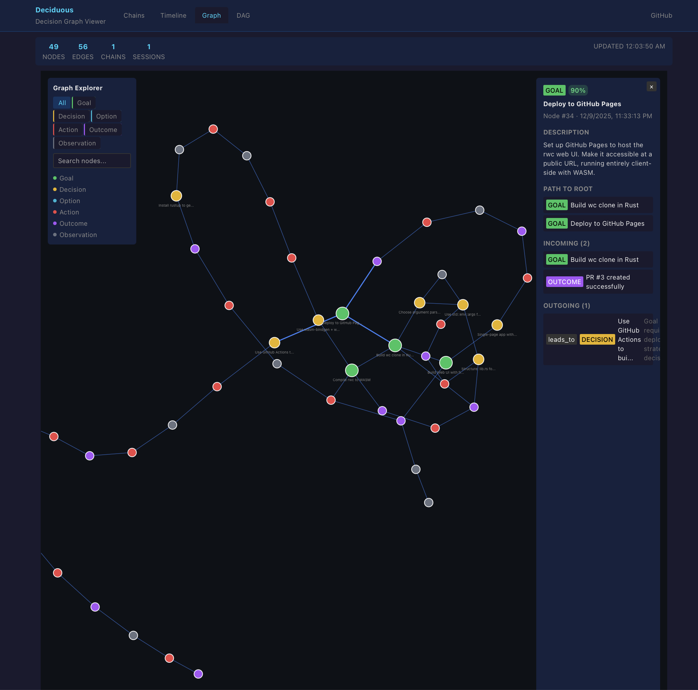

# Deciduous

**Decision graph tooling for Claude Code.** Track every goal, decision, and outcome. Survive context loss. Generate PR writeups automatically.

```bash
cargo install deciduous
cd your-project
deciduous init
```

---

## How It Works With Claude

Deciduous gives Claude a persistent memory that survives context loss. As Claude works, it logs decisions to a graph. When a session ends or context compacts, the graph remains - queryable by the next session.

### The Workflow

1. **Session starts** → Claude runs `/context` to see past decisions
2. **Claude works** → Logs goals, decisions, actions as it goes
3. **Session ends** → Graph survives for next time
4. **PR time** → Generate writeup + visualization from the graph

### What Claude Logs

Every step is captured in real-time:

```
Goal: "Compile rwc to WASM"
  └─> Decision: "Use wasm-bindgen + wasm-pack"
        └─> Action: "Add wasm-bindgen config"
              └─> Action: "Add lib.rs exports"
                    └─> Observation: "Homebrew lacks wasm32 target"
                          └─> Decision: "Install rustup"
                                └─> Outcome: "WASM build successful"
```

### PR Generation

Generate a full PR writeup with decision graph visualization:

```bash
deciduous dot --auto --nodes 12-24      # Branch-specific PNG
git add docs/decision-graph-*.png && git push
deciduous writeup --auto -t "WASM Support" --nodes 12-24
```

The writeup includes goals, decisions, actions, outcomes, and an embedded graph:


### Interactive Web Viewer

View the full decision graph with `deciduous serve`:




---

## Quick Start

### 1. Install

```bash
cargo install deciduous
```

### 2. Initialize in your project

```bash
cd your-project
deciduous init
```

This creates:
- `.deciduous/` - SQLite database
- `.claude/commands/decision.md` - `/decision` slash command
- `.claude/commands/context.md` - `/context` slash command
- `.github/workflows/cleanup-decision-graphs.yml` - Auto-cleanup PNGs after PR merge
- `CLAUDE.md` - Project instructions with workflow

### 3. Start tracking

```bash
# Claude logs decisions as it works
deciduous add goal "Build feature X" -c 90
deciduous add action "Implementing feature X" -c 85
deciduous link 1 2 -r "Goal leads to action"

# View the graph
deciduous serve
```

---

## Commands

```bash
# Core workflow
deciduous init                           # Set up in current directory
deciduous add <type> "<title>" -c 85     # Add node (goal/decision/action/outcome/observation)
deciduous link <from> <to> -r "reason"   # Connect nodes
deciduous nodes                          # List all nodes
deciduous serve                          # Start web viewer

# PR workflow (recommended: use --auto for branch-specific filenames)
deciduous dot --auto --nodes 1-11        # Generate docs/decision-graph-{branch}.png
deciduous writeup --auto -t "Title" --nodes 1-11   # Generate PR writeup with PNG

# Export
deciduous sync                           # Export to JSON
deciduous graph                          # Full JSON to stdout
```

### Node Types

| Type | Purpose | Example |
|------|---------|---------|
| `goal` | High-level objectives | "Add user authentication" |
| `decision` | Choice points | "Choose auth method" |
| `option` | Approaches considered | "Use JWT tokens" |
| `action` | What was implemented | "Added JWT middleware" |
| `outcome` | What happened | "JWT auth working" |
| `observation` | Technical insights | "Existing code uses sessions" |

### Confidence Weights

Every node can have a confidence score (0-100):

| Range | Meaning |
|-------|---------|
| 90-100 | Certain, proven |
| 70-89 | High confidence |
| 50-69 | Moderate, some unknowns |
| 30-49 | Experimental |
| 0-29 | Speculative |

---

## Why Deciduous?

**Claude loses context.** Sessions end, memory compacts, decisions evaporate. Six months later, no one remembers *why* you chose approach A over approach B.

**Deciduous fixes this.** Every decision is tracked in a queryable graph that persists forever. When Claude starts a new session, it can query the graph to understand past decisions - even from sessions it never saw.

This isn't documentation written after the fact. It's a real-time record of how software gets built, captured as decisions happen.

---

## Building from Source

```bash
git clone https://github.com/notactuallytreyanastasio/deciduous.git
cd deciduous
cargo build --release
./target/release/deciduous --help
```

---

## License

MIT
